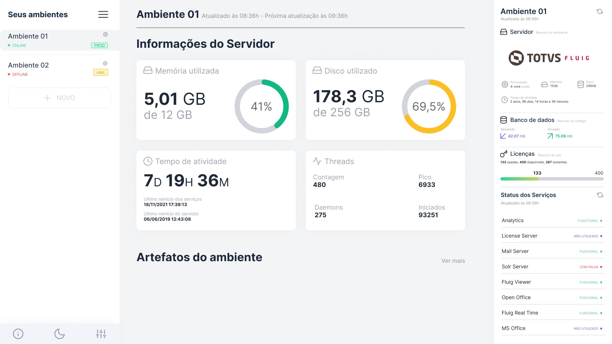
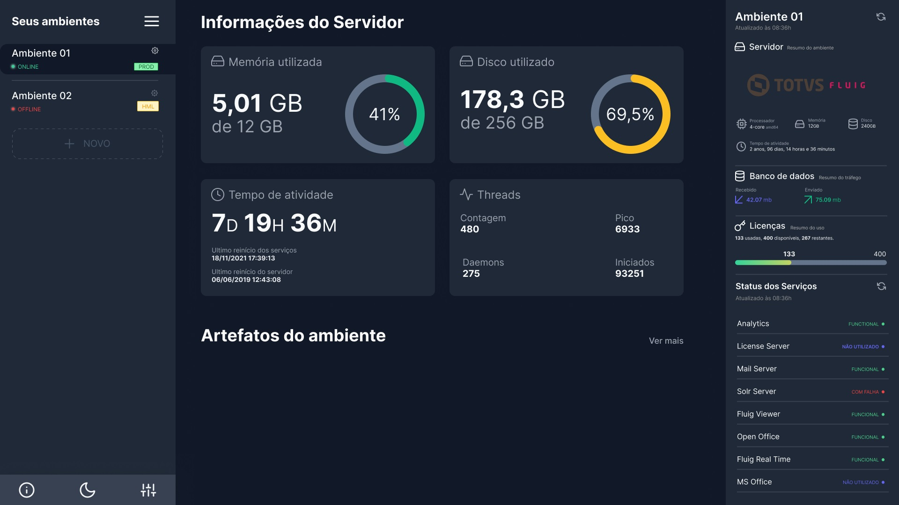

# Fluig Monitor

> Em desenvolvimento

## Sobre

Um monitor de ambiente para o Fluig.

O monitoramento é realizado através das APIs de monitoramento e estatísticas.

> Tema padrão

> Tema escuro

As imagens acima são apenas protótipos.

Esta aplicação está sendo desenvolvida utilizando React, Electron e Typescript.
