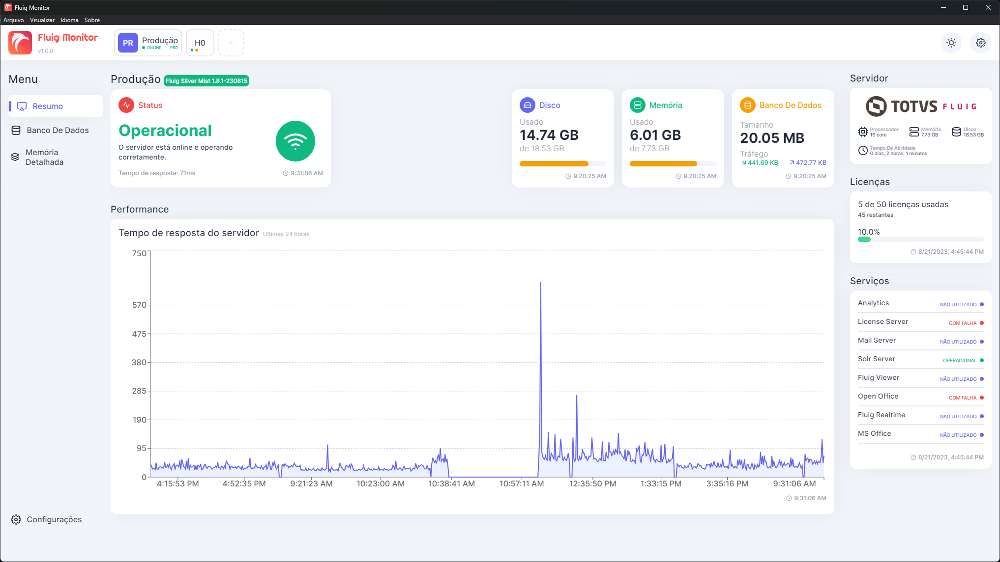
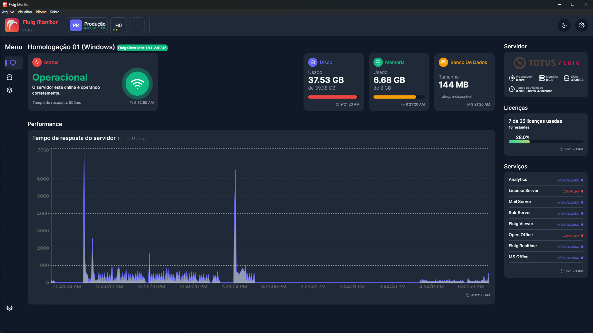
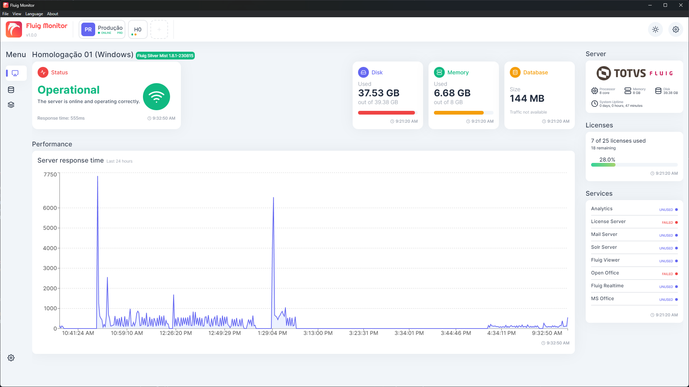
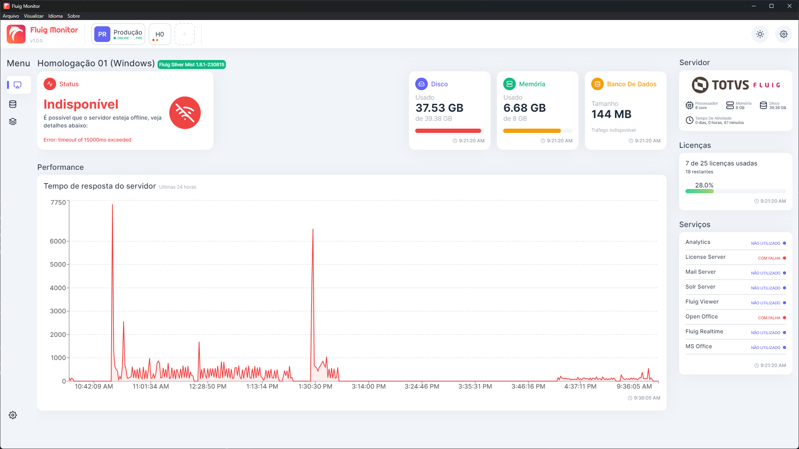
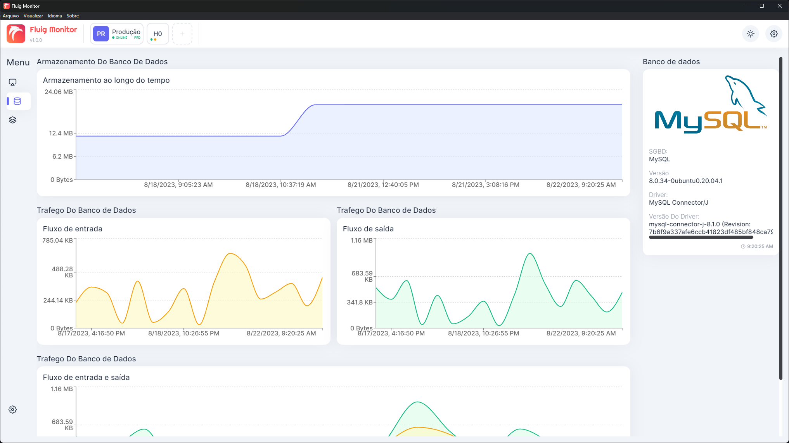
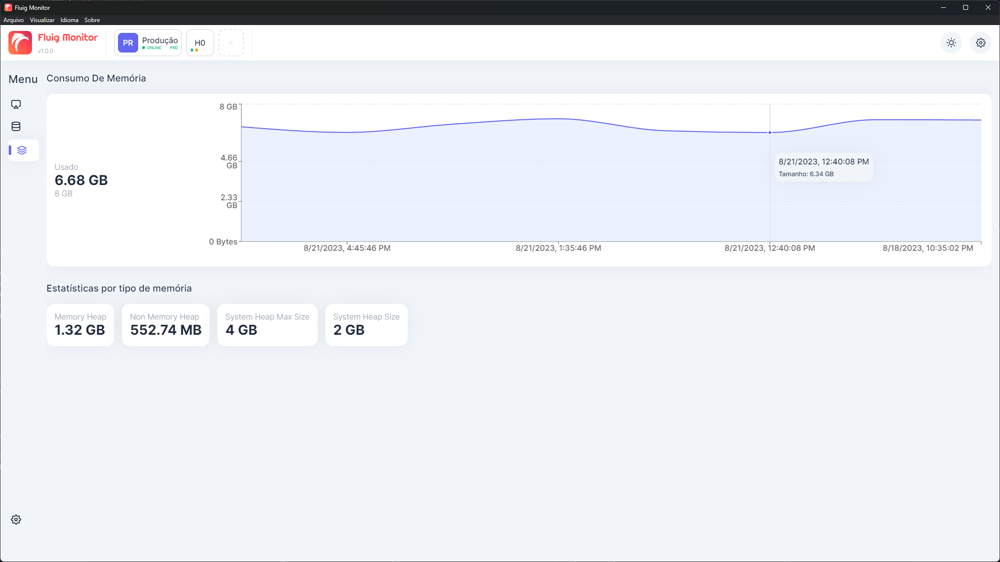

#


<div align="center">

[](https://github.com/luizf-lf/fluig-monitor/releases)
[](https://github.com/luizf-lf/fluig-monitor/releases)
[](https://github.com/luizf-lf/fluig-monitor/issues?q=is%3Aopen+is%3Aissue)
[](https://github.com/luizf-lf/fluig-monitor/issues?q=is%3Aissue+is%3Aclosed)
[](./README.md)
[](./README.en.md)
[](https://wakatime.com/badge/github/luizf-lf/fluig-monitor)

</div>

## Índice

- [Sobre](#sobre)
- [Funcionalidades](#funcionalidades)
- [Imagens](#imagens)
- [Executando o projeto em modo de desenvolvimento](#executando-o-projeto-em-modo-de-desenvolvimento)
- [Estrutura Do Projeto](#estrutura-do-projeto)
  - [Visão Geral](#visão-geral)
  - [Estrutura do processo main](#estrutura-do-processo-main)
  - [Estrutura do processo renderer](#estrutura-do-processo-renderer)
- [Instruções De Uso](#instruções-de-uso)
  - [Monitorando um ambiente](#monitorando-um-ambiente)
- [Informações adicionais](#informações-adicionais)
- [Contribuindo](#contribuindo)
- [Estatísticas de Uso](#estatísticas-de-uso)

## Sobre

Uma aplicação desktop, desenvolvida em **Electron**, utilizada para monitorar ambientes **Fluig**.

O monitoramento é realizado através da **API Rest** da plataforma, também utilizada para coleta de dados do **monitor**, **estatísticas** e **licenças** da plataforma , conforme a [documentação](https://tdn.engpro.totvs.com.br/pages/releaseview.action?pageId=284881802).

Esta aplicação veio sendo desenvolvida inicialmente para fins **didáticos**, com a intenção de aprender sobre UI/UX, desenvolvimento de aplicações desktop com `React`, `Electron`, `Typescript`, e o uso das `APIs` do Fluig, mas aos poucos vem se tornando uma aplicação que possibilite gerir uma melhor observabilidade sobre a plataforma Fluig.

A aplicação possui um banco de dados SQLite que é criado automaticamente na primeira execução do aplicativo. Na build de produção, o mesmo ficará disponível na pasta `%appdata%/fluig-monitor/fluig-monitor.db`, no caso da versão de desenvolvimento, o mesmo será criado dentro da pasta `.prisma`, na raiz do projeto. Mais informações estão disponíveis nas instruções de execução do projeto abaixo.

As migrações entre as versões do banco de dados são executadas automaticamente, graças ao cliente do Prisma ORM embutido juntamente na aplicação.

## Funcionalidades

Algumas das principais funcionalidades já implementadas:

- Interface totalmente customizada, com tema claro e escuro.
- Internacionalização (i18n) em Português, Inglês e Espanhol.
- Notificações no desktop.
- Verificação de disponibilidade de servidor.
- Coleta de informações do monitor, estatísticas e licenciamento da plataforma.
- Banco de dados local em SQLite.
- Migrações de banco de dados automáticas.
- Dashboard com gráfico de exibição de tempo de resposta da plataforma.
- Telas de visão geral, banco de dados e memória detalhada do servidor.

Novas funcionalidades vem sendo estudadas constantemente. Verifique na aba [Issues](https://github.com/luizf-lf/fluig-monitor/issues) as melhorias que já foram mapeadas publicamente e/ou sugeridas por outras pessoas.

## Imagens


> Lista De Ambientes, com mini gráfico de disponibilidade.



> Visão Do Ambiente (Tema Claro)



> Visão Do Ambiente (Tema Escuro)



> Visão Do Ambiente (i18n em Inglês)



> Visão Do Ambiente (Indisponibilidade)



> Visão Do Banco de Dados



> Visão De Detalhes do Uso da Memória

## Executando o projeto em modo de desenvolvimento

1. Configure o arquivo .env:

   O repositório contem um arquivo `.env.example` com as configurações do caminho do banco de dados utilizado (SQLite). Copie o arquivo e o renomeie para `.env`, mantendo as mesmas configurações conforme arquivo de exemplo.

2. Instale as dependências necessárias:

   ```shell
   $ yarn
   ```

   ou

   ```shell
   $ npm install
   ```

3. Execute o projeto em modo de desenvolvimento:

   ```shell
   $ yarn start
   ```

   ou

   ```shell
   $ npm run start
   ```

   > Não é necessário executar nenhum comando do Prisma para migrar o banco de dados, pois as migrações são executadas automaticamente pela aplicação.

4. Executando a build de produção da aplicação (opcional).

   Caso desejar criar uma build de produção da aplicação, execute o comando a seguir:

   ```shell
   $ yarn package
   ```

   ou

   ```shell
   $ npm run package
   ```

## Estrutura Do Projeto

### Visão Geral

O Projeto é desenvolvido utilizando Electron, e por isso, utiliza de dois processos principais, o `main` e o `renderer`, onde o processo `main` é o processo principal do Electron, que funciona como o back-end da aplicação, e é responsável por lidar com operações HTTP, sistema de arquivos e schedule de tarefas, por exemplo. O processo `renderer` é o processo responsável pelo front-end da aplicação, que neste caso, é utilizado o React.

O projeto também possui uma pasta `common` contendo recursos compartilhados entre os dois processos, como interfaces, funções utilitárias e classes de validação.

Demonstração:

```text
src/
  ├── common/
  ├── main/
  └── renderer/
```

A estrutura de pastas poderá ser alterada conforme necessidade.

### Estrutura do processo main

A pasta referente ao processo `main` (src/main) foi estruturada da seguinte forma:

```text
src/
  ├── ...
  └── main/
        ├── classes/
        ├── controllers/
        ├── database/
        ├── generated/
        ├── interfaces/
        ├── services/
        ├── utils/
        └── ...
```

Onde:

- **classes:** Contém classes utilitárias utilizadas apenas pelo processo main.
- **controllers:** Contém os controllers principais da aplicação, responsáveis principalmente por operações com o banco de dados.
- **database:** Contém os utilitários de configuração do banco de dados com o prisma.
- **generated:** Contém arquivos gerados pelo prisma. São ignorados pelo git.
- **interfaces:** Contém interfaces utilizados pelo processo main.
- **services:** Contém funções / serviços que lidam com requisições HTTP ao Fluig.
- **utils:** Utilitários utilizados pelo processo main.

### Estrutura do processo renderer

A pasta referente ao processo `renderer` (src/renderer) foi estruturada da seguinte forma:

```text
src/
  ├── ...
  └── renderer/
        ├── assets/
        ├── classes/
        ├── components/
              ├── base/
              ├── container/
              └── layout/
        ├── contexts/
        ├── ipc/
        ├── pages/
        ├── utils/
        └── ...
```

Onde:

- **assets:** Contém arquivos de imagem, css e svg utilizados pelo renderer.
- **classes:** Contém classes utilizadas apenas pelo renderer, principalmente para validação de formulários.
- **components:** Contém os componentes React utilizados pelo renderer, estruturados da seguinte forma:
  - **base:** Contém componentes base, como botões customizados, por exemplo.
  - **container:** Contém componentes de negócio, como painéis de exibição de dados, por exemplo.
  - **layout:** Contém componentes que agrupam outros componentes, como uma dashboard por exemplo.
- **contexts:** Contém componentes de contexto que utilizam a Context API do React.
- **ipc:** Contém funções utilitárias que fazem a ponte com o processo main utilizando Inter Process Communication.
- **pages:** Contém componentes que funcionam como páginas, são vinculadas às rotas do React Router.
- **utils:** Contém funções utilitárias utilizadas pelo renderer.

## Instruções De Uso

### Monitorando um ambiente

Para começar a monitorar um ambiente, siga os passos a seguir:

1. Abra a aplicação. Ao abrir pela primeira vez, a aplicação irá criar o banco de dados (SQLite) e aplicar as migrações automaticamente.

2. Clique no botão de "+" na tela inicial ou na barra de navegação para incluir um novo ambiente.

3. Na tela que irá surgir, insira as informações do ambiente:

   **Nome do Ambiente:** O nome do ambiente a ser monitorado, esta informação é utilizada apenas para identificação pela aplicação.

   **Url de Domínio:** A url de domínio do ambiente, seguindo o padrão `protocolo://endereço:porta`, sem a barra no final da url. Exemplo: `https://teste.fluig.com` ou `http://dev.fluig.com:8080`

   **Autenticação:** Nos campos de autenticação, você deverá inserir os respectivos valores da Consumer Key, Consumer Secret, Access Token e Token Secret do usuário aplicativo criado na plataforma (Saiba mais em [Plataforma ❙ Oauth application](https://tdn.totvs.com/pages/releaseview.action?pageId=234455783)). É importante notar que este usuário aplicativo deve ser administrador ou possuir permissão sobre as APIs `/monitoring/api/v1/statistics/report`, `/monitoring/api/v1/monitors/report` e `/license/api/v1/licenses`. Para verificar se as configurações estão corretas, você pode utilizar o botão `Testar Conexão`.

   **Verificação do Servidor:** Neste campo, é possível definir a frequência de verificação da disponibilidade do servidor. Por exemplo, se escolher `15 segundos`, o servidor será verificado a cada 15 segundos.

   **Coleta de Dados:** Neste campo, é possível definir a frequência da coleta dos dados do **Monitor**, **Estatísticas** e **Licenças**. O período mínimo é de 15 minutos, que é o período mínimo que a plataforma utiliza para atualizar as informações coletadas das estatísticas do servidor.

4. Clique no botão confirmar. O ambiente será salvo, terá sua disponibilidade verificada e seus dados coletados pela primeira vez. Após clicar em salvar, você será direcionado para a tela inicial, contendo a lista dos ambientes sendo monitorados.

5. Acesse o ambiente através da lista na tela inicial ou da barra de navegação no topo.

6. As informações serão exibidas na dashboard na tela principal do ambiente. Caso um dos componentes nesta tela apresentar a informação "Sem dados disponíveis", pode ser que algum dado não tenha sido coletado corretamente devido à permissão do usuário aplicativo cadastrado. Neste caso, revise a permissão na plataforma Fluig e as configurações do ambiente cadastrado, e aguarde até que a próxima sincronização ocorra.

## Informações adicionais

Apesar de a aplicação já ter suas principais funcionalidades desenvolvidas (monitoramento, coleta e exibição de estatísticas) e já possuir uma release 1.0, novas funcionalidades e correções serão implementadas continuamente.
Verifique através da aba [Releases](https://github.com/luizf-lf/fluig-monitor/releases) a última versão disponível da aplicação.

## Contribuindo

Caso queira sugerir novas melhorias ou novas features para a aplicação, crie uma [issue](https://github.com/luizf-lf/fluig-monitor/issues) neste repositório, a viabilidade de sua sugestão será estudada e implementada de acordo.

Caso queira contribuir diretamente com o código fonte da aplicação, é recomendável realizar um **fork** deste repositório, e fazer suas alterações localmente, e então realizar um **pull request** contendo um descritivo de suas alterações realizadas para que as mudanças realizadas sejam implementadas.

## Estatísticas de Uso

Afim de entender como o Fluig Monitor é utilizado, é realizada a coleta de algumas estatísticas de uso periodicamente utilizando a plataforma do Google Analytics, sem identificação de usuário. Desta forma é possível entender como o aplicativo é utilizado, e quais features são realmente importantes, e quais das possíveis melhorias devem ser priorizadas.

> Dados sensíveis ou identificáveis, como por exemplo, nome ou url do ambiente Fluig monitorado **não** são coletados nas estatísticas.

Para promover a rápida transparência, abaixo fica listado quais métricas o Fluig Monitor pode coletar:

- Quando o aplicativo é iniciado. Sendo coletado:
  - Versão do aplicativo.
  - Nome do aplicativo.
  - Modo do aplicativo (Produção ou Desenvolvimento).
  - Resolução da tela.
  - Plataforma do sistema operacional (Linux, Windows).
  - Tipo do sistema operacional (Seguindo o formato [uname](https://linux.die.net/man/3/uname))
  - Release do sistema operacional
  - Arquitetura do sistema operacional (x32, x64, arm64).
- Quando o aplicativo é minimizado.
- Quando o aplicativo é maximizado.
- Quando o tamanho da janela do aplicativo é alterada. Sendo coletado:
  - Tamanho da janela.
- Quando o aplicativo perde o foco.
- Quando o aplicativo entra em foco.
- Quando o aplicativo é restaurado (Após ser minimizado).
- Quando o aplicativo é fechado. Sendo coletado:
  - A forma como o aplicativo foi fechado (Bandeja do sistema ou menu de opções).
- Quando o aplicativo entra ou sai do modo de tela cheia.
- Quando o aplicativo emite um erro e é fechado inesperadamente.
- Quando uma atualização do aplicativo é recusada.
- Quando o idioma do aplicativo é alterado.
- Quando você acessa um link externo do aplicativo (Para reportar um bug, por exemplo.)
- Quando um ambiente é criado. Sendo coletado:
  - Release do ambiente.
  - Tipo do ambiente (Produção, Homologação ou Desenvolvimento).
  - Intervalo de ping escolhido.
  - Intervalo de coleta de estatísticas do ambiente escolhido.
- Quando um ambiente é excluído.
- Quando um ambiente é editado.
- Quando a base de dados local do Fluig Monitor é migrada.
- Quando uma sincronização é executada. Sendo coletado:
  - Se o computador em que o Fluig Monitor está instalado está conectado à internet.
- Quando o computador em que o Fluig Monitor está instalado é desconectado da internet.
- Quando um ambiente possui um tempo de resposta alto.
- Quando um ambiente volta a ter um tempo de resposta normal.
- Quando um ambiente fica offline.
- Quando um ambiente volta a ficar online.
- Quando uma tela do Fluig Monitor é visualizada, sendo coletado:
  - Código identificador (id) da tela.
  - Título da tela.
  - Tempo de visualização.
- Quando um botão é clicado.
- Quando o tema do Fluig Monitor é alterado.

Ao utilizar as builds de produção do Fluig Monitor, você consente em participar da coleta de estatísticas.

Caso não queira participar, você pode realizar um clone do repositório e realizar uma build própria do Fluig Monitor. A coleta será desativada automaticamente caso as variáveis de ambiente não sejam definidas no arquivo `.env` do projeto.
