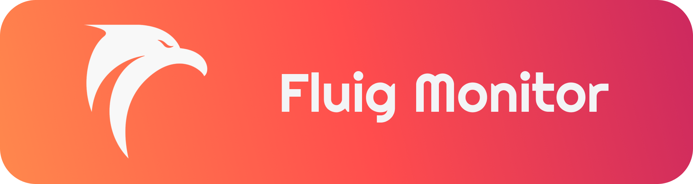
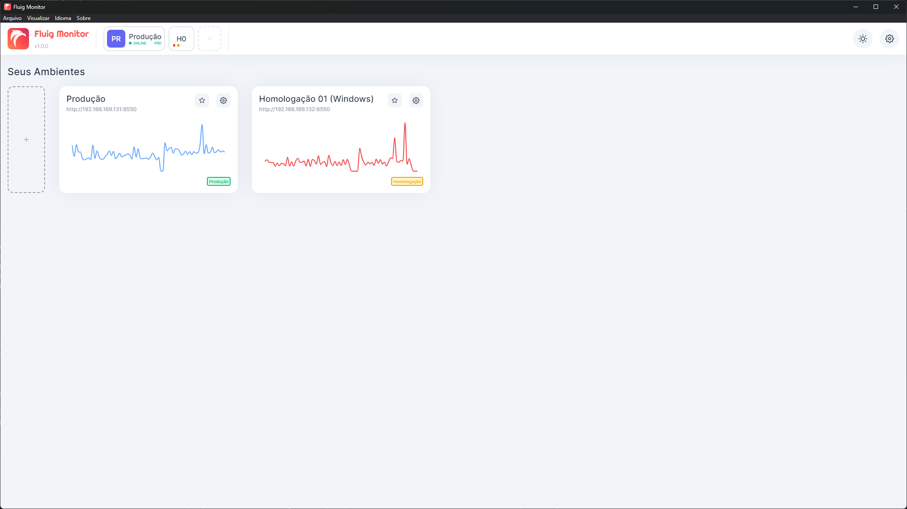

# Fluig Monitor

> Check out the **english** documentation [here](./docs/README.md).



## Sobre

Uma aplicação desktop, desenvolvida em **Electron**, utilizada para monitorar ambientes **Fluig**.

O monitoramento é realizado através da **API Rest** da plataforma, também utilizada para coleta de dados do **monitor**, **estatísticas** e **licenças** da plataforma , conforme a [documentação](https://tdn.engpro.totvs.com.br/pages/releaseview.action?pageId=284881802).

Esta aplicação veio sendo desenvolvida inicialmente para fins **didáticos**, com a intenção de aprender sobre UI/UX, desenvolvimento de aplicações desktop com `React`, `Electron`, `Typescript`, e o uso das `APIs` do Fluig, mas aos poucos vem se tornando uma aplicação que possibilite gerir uma melhor observabilidade sobre a plataforma Fluig em si.

A aplicação possui um banco de dados SQLite que é criado automaticamente na primeira execução do aplicativo. Na build de produção, o mesmo ficará disponível na pasta `%appdata%/fluig-monitor/app.db`, no caso da versão de desenvolvimento, o mesmo será criado dentro da pasta `.prisma`, na raiz do projeto. Mais informações estão disponíveis nas instruções de execução do projeto abaixo.

As migrações entre as versões do banco de dados são executadas automaticamente, graças ao cliente do Prisma ORM embutido juntamente na aplicação.

## Funcionalidades

Algumas das principais funcionalidades já implementadas:

- Interface totalmente customizada, com tema claro e escuro.
- Internacionalização (i18n) em Português e Inglês.
- Notificações no desktop.
- Verificação de disponibilidade de servidor.
- Coleta de informações do monitor, estatísticas e licenciamento da plataforma.
- Banco de dados local em SQLite.
- Migrações de banco de dados automáticas.
- Dashboard com gráfico de exibição de tempo de resposta da plataforma.

Novas funcionalidades vem sendo estudadas constantemente. Verifique na aba [Issues](https://github.com/luizf-lf/fluig-monitor/issues) as melhorias que já foram mapeadas publicamente e/ou sugeridas por outras pessoas.

## Imagens


> Visão Do Ambiente (Tema Claro)


> Visão Do Ambiente (Tema Escuro)


> Visão Do Ambiente (I18N) em inglês.


> Visão Do Ambiente (Indisponibilidade)



> Lista De Ambientes, com mini gráfico de disponibilidade.

## Executando o projeto em modo de desenvolvimento

1. Configure o arquivo .env:

   O repositório contem um arquivo `.env.example` com as configurações do caminho do banco de dados utilizado (SQLite). Copie o arquivo e o renomeie para `.env`, mantendo as mesmas configurações conforme arquivo de exemplo.

2. Instale as dependências necessárias:

   ```shell
   $ yarn
   ```

   ou

   ```shell
   $ npm install
   ```

3. Execute o projeto em modo de desenvolvimento:

   ```shell
   $ yarn start
   ```

   ou

   ```shell
   $ npm run start
   ```

   > Não é necessário executar nenhum comando do Prisma para migrar o banco de dados, pois as migrações são executadas automaticamente pela aplicação.

4. Executando a build de produção da aplicação (opcional).

   Caso desejar criar uma build de produção da aplicação, execute o comando a seguir:

   ```shell
   $ yarn package
   ```

   ou

   ```shell
   $ npm run package
   ```

## Instruções De Uso

### Cadastrando um ambiente

Para começar a monitorar um ambiente, siga os passos a seguir:

1. Abra a aplicação. Ao abrir pela primeira vez, a aplicação irá criar o banco de dados (SQLite) e aplicar as atualizações automaticamente.

2. Clique no botão de "+" na tela inicial ou na barra de navegação para incluir um novo ambiente.

3. Na tela que irá surgir, insira as informações do ambiente:

   **Nome do Ambiente:** O nome do ambiente a ser monitorado, esta informação é utilizada apenas para identificação pela aplicação.

   **Url de Domínio:** A url de domínio do ambiente, seguindo o padrão `protocolo://endereço:porta`, sem a barra no final da url. Exemplo: `https://teste.fluig.com` ou `https://dev.fluig.com:8080`

   **Autenticação:** Nos campos de autenticação, você deverá inserir os respectivos valores da Consumer Key, Consumer Secret, Access Token e Token Secret do usuário aplicativo criado na plataforma. É importante notar que este usuário aplicativo deve ser administrador ou possuir permissão sobre as APIs `/monitoring/api/v1/statistics/report`, `/monitoring/api/v1/monitors/report` e `/license/api/v1/licenses`. Para verificar se as configurações estão corretas, você pode utilizar o botão `Testar Conexão`.

   **Verificação do Servidor:** Neste campo, é possível definir a frequência de verificação da disponibilidade do servidor. Por exemplo, se escolher `15 segundos`, o servidor será verificado a cada 15 segundos.

   **Coleta de Dados:** Neste campo, é possível definir a frequência da coleta dos dados do **Monitor**, **Estatísticas** e **Licenças**

4. Clique no botão confirmar. O ambiente será salvo, terá sua disponibilidade verificada e seus dados coletados pela primeira vez. Após clicar em salvar, você será direcionado para a tela inicial, contendo a lista dos ambientes sendo monitorados.

5. Acesse o ambiente através da lista na tela inicial ou da barra de navegação no topo.

6. As informações serão exibidas na dashboard na tela principal do ambiente. Caso um dos componentes nesta tela apresentar a informação "Sem dados disponíveis", pode ser que algum dado não tenha sido coletado corretamente devido à permissão do usuário aplicativo cadastrado. Neste caso, revise a permissão na plataforma Fluig e as configurações do ambiente cadastrado, e aguarde até que a próxima sincronização ocorra.

## Informações adicionais

Apesar de a aplicação já ter suas principais funcionalidades desenvolvidas (monitoramento, coleta e exibição de estatísticas), ainda existem muitas funcionalidades que serão desenvolvidas ao longo do tempo até que a aplicação tenha uma release de versão inicial.
Atualmente a aplicação está em versão `preview`, disponível através da aba [Releases](https://github.com/luizf-lf/fluig-monitor/releases) para aqueles que quiserem testar a aplicação.

## Contribuindo

Caso queira sugerir novas melhorias ou novas features para a aplicação, crie uma [issue](https://github.com/luizf-lf/fluig-monitor/issues) neste repositório, a viabilidade de sua sugestão será estudada e implementada de acordo.

Caso queira contribuir diretamente com o código fonte da aplicação, é recomendável realizar um **fork** deste repositório, e fazer suas alterações localmente, e então realizar um **pull request** contendo um descritivo de suas alterações realizadas para que as mudanças realizadas sejam implementadas.
