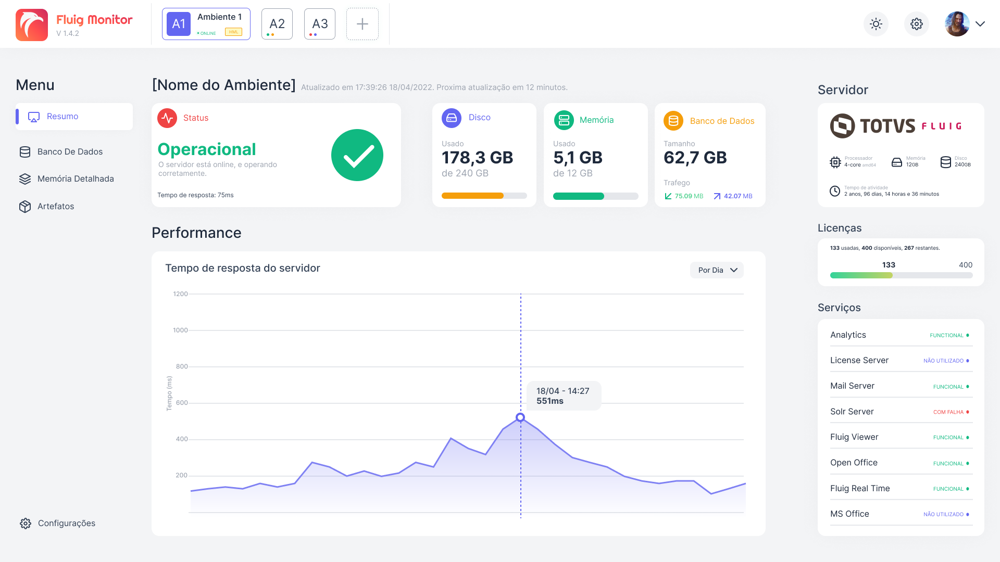

# Fluig Monitor

> Check out the **english** documentation [here](./docs/README.md).


## Sobre

Uma aplicação desktop, desenvolvida em **Electron**, utilizada para monitorar ambientes **Fluig**.

O monitoramento é realizado através das **APIs** de monitoramento e estatísticas, conforme a [documentação](https://tdn.engpro.totvs.com.br/pages/releaseview.action?pageId=284881802).

Esta aplicação está sendo desenvolvida para fins **didáticos**, com a intenção de aprender um pouco sobre o desenvolvimento com `React`, `Electron`, `Typescript`, e o uso das `APIs` do Fluig.

## Imagens



> A imagem acima é um **protótipo** da aplicação, e irá sofrer mudanças.

## Funcionalidades

Algumas funcionalidades que serão (ou já foram) implementadas:

- Tema escuro
- Internacionalização (i18n)
- Análise de histórico do ambiente
- Análise preditiva de saúde do ambiente
- Notificações no desktop

## Execute o projeto

Para executar este projeto:

1. Instale as dependências necessárias:

   ```shell
   $ yarn
   ```

   ou

   ```shell
   $ npm install
   ```

2. Execute o projeto em modo de desenvolvimento:

   ```shell
   $ yarn start
   ```

   ou

   ```shell
   $ npm run start
   ```

## Demais informações

Conforme falado, esta aplicação está sendo desenvolvida para fins didáticos, e _ainda_ não possui uma release disponível para uso público. Em breve será lançada a versão 1.0 da aplicação. ~~Antes de Half Life 3~~

### Tem alguma sugestão de desenvolvimento?

Crie uma [issue](https://github.com/luizf-lf/fluig-monitor/issues) neste repositório, a viabilidade de sua sugestão será estudada e implementada de acordo.
