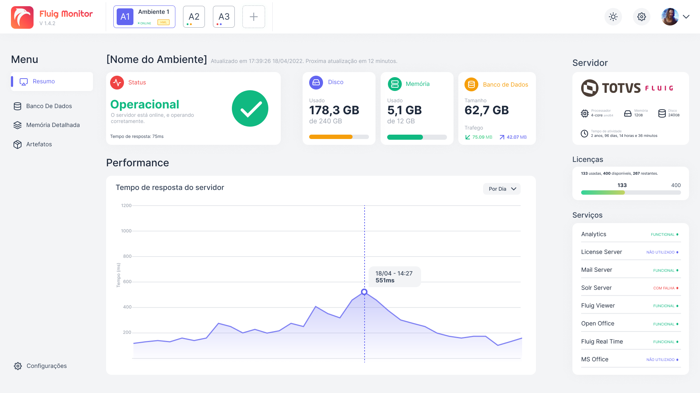

# Fluig Monitor

> Confira a documentação em **português** clicando [aqui](../README.md).


## About

A desktop application, developed with **Electron**, used as a monitoring dashboards for **Fluig** environments.

The monitoring is done trough the monitoring and statistics **API**, as shown on the [documentation](https://tdn.totvs.com/display/fluigeng/Platform+%7C+Platform+Services+Monitor).

This application is being developed for **educational** purposes, with the intention of learning a bit more about UI/UX, development with `React`, `Electron`, `Typescript`, and the use of Fluig `APIs`.

## Images

### White Theme



### Dark Theme


> The above images are **prototypes**, and are subject to changes.

## Features

Some features that will be (or already are) implemented:

- Dark mode
- Internationalization (i18n)
- Environment history analysis
- Predictive environment health analysis
- Desktop notifications

## Running this project

To run this project:

1. Install the necessary dependencies:

   ```shell
   $ yarn
   ```

   or

   ```shell
   $ npm install
   ```

2. Run the app in development mode:

   ```shell
   $ yarn start
   ```

   or

   ```shell
   $ npm run start
   ```

## Additional information

As mentioned, this application is being developed for educational purposes, and _still_ does not have a release available for public use. Version 1.0 of the application will be released soon. ~~Before Half Life 3~~

### Any development suggestions?

Create an [issue](https://github.com/luizf-lf/fluig-monitor/issues) on this repo, and the viability of your suggestion will be studied.
