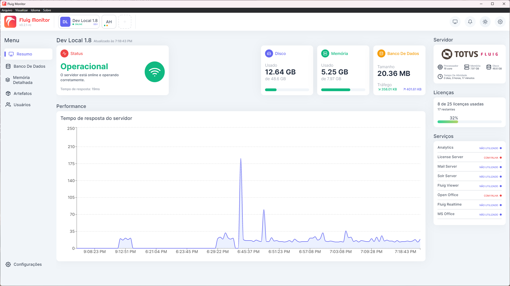
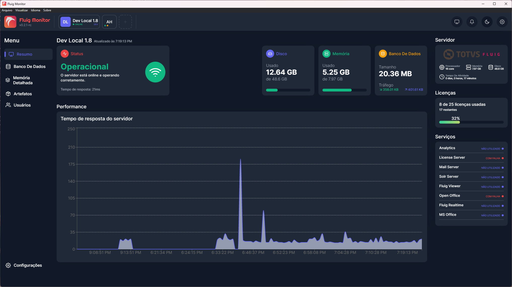
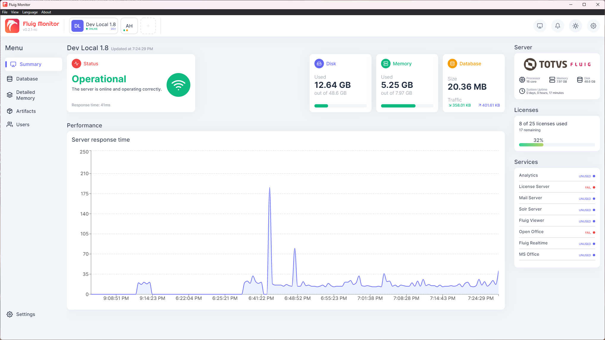
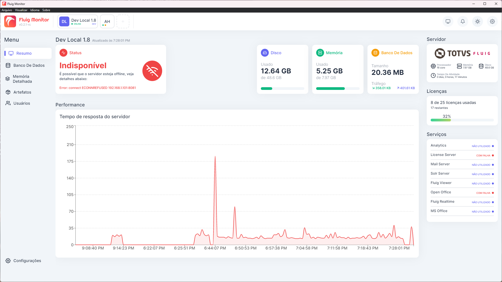
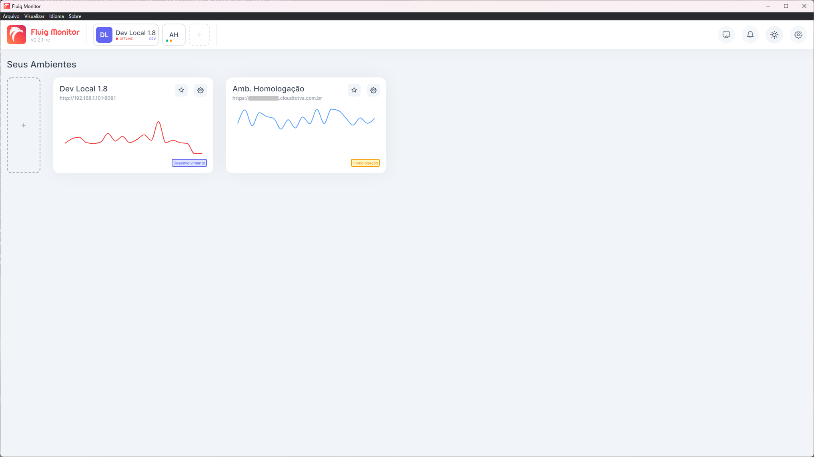

# Fluig Monitor

> Confira a documentação em **português** clicando [aqui](../README.md).


## About

A desktop application, developed in **Electron**, used to monitor **Fluig** environments.

Monitoring is performed through the platform's **Rest API**, also used to collect **monitor** data, **statistics** and platform **license**, as per the [documentation](https://tdn.totvs.com/display/fluigeng/Platform+%7C+Platform+Services+Monitor).

This application was initially developed for **educational** purposes, with the intention of learning about UI/UX, development of desktop applications with `React`, `Electron`, `Typescript`, and the use of Fluig `API's`, but little by little it has become an application that allows better management of observability on the Fluig platform itself.

The application has an SQLite database that is automatically created on the first application run. In the production build, it will be available in the `%appdata%/fluig-monitor/app.db` folder, in the case of the development version, it will be created in the `.prisma` folder, in the root of the project. More information is available in the project execution instructions below.

Migrations between database versions are performed automatically, thanks to the Prisma ORM client built into the application.

## Features

Algumas das principais funcionalidades já implementadas:

- Fully customized interface with light and dark theme.
- Internationalization (i18n) in Portuguese and English.
- Desktop notifications.
- Server availability check.
- Collection of monitor information, statistics and platform licensing.
- Local database in SQLite.
- Automatic database migrations.
- Dashboard with platform response time display graph.

## Images

### White Theme



> Environment View (White Theme)



> Environment View (Dark Theme)



> Environment View (I18N) in english.



> Environment View (Unavailability)



> Environment List, with a mini availability graph.

## Running the project in development mode

1. Configure the .env file:

   The repository contains an `.env.example` file with the database (SQLite) path settings used. Copy the file and rename it to `.env`, keeping the same settings as the example file.

2. Install the necessary dependencies:

   ```shell
   $ yarn
   ```

   or

   ```shell
   $ npm install
   ```

3. Run the app in development mode:

   ```shell
   $ yarn start
   ```

   or

   ```shell
   $ npm run start
   ```

   > It is not necessary to run any Prisma command to migrate the database, as the migrations are performed automatically by the application.

4. Running the production build of the application (optional).

   If you want to create a production build of the application, run the following command:

   ```shell
   $ yarn package
   ```

   or

   ```shell
   $ npm run package
   ```

## Additional Information

Although the application already has its main functionalities developed (monitoring, collection and display of statistics), there are still many functionalities that will be developed over time until the application has an initial version release.
Currently the application is in a `preview` release, available for those who want to test the application.

### Any development suggestions?

Create an [issue](https://github.com/luizf-lf/fluig-monitor/issues) on this repo, and the viability of your suggestion will be studied.
